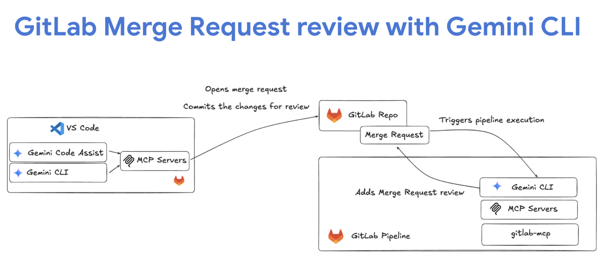
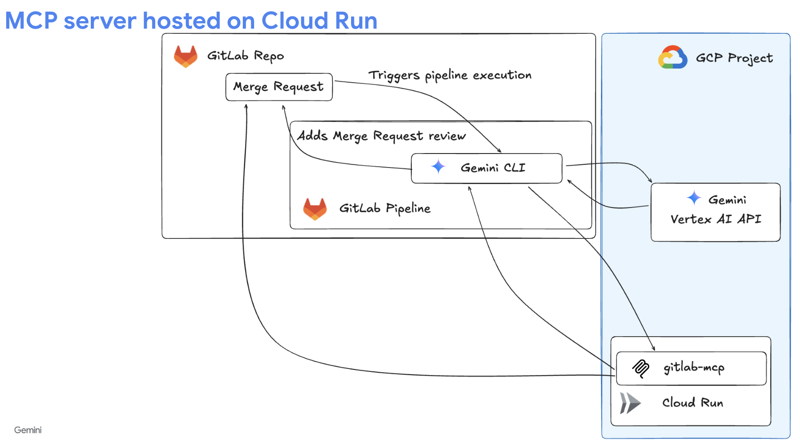
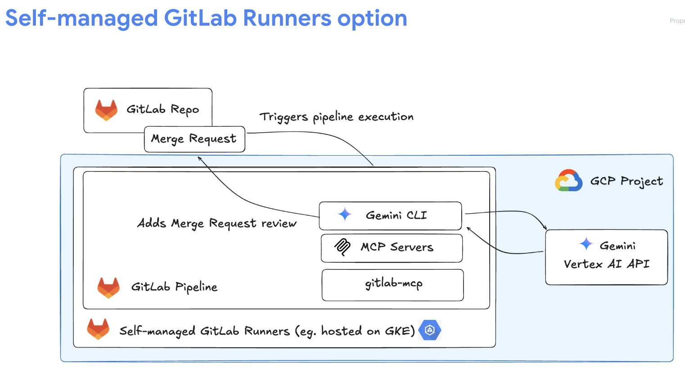
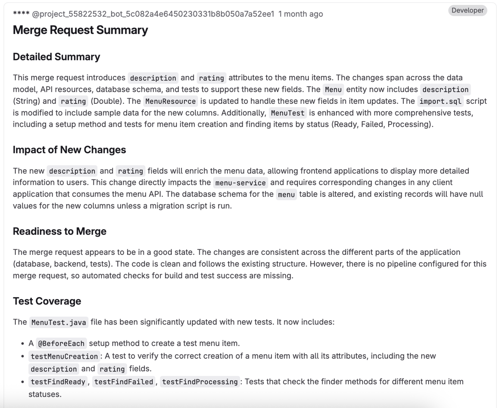

# GitLab Merge Request (MR) Code Review with Gemini CLI

This repository provides examples and architectural patterns for integrating Gemini CLI into GitLab CI/CD pipelines to perform automated code reviews on Merge Requests (MRs). It covers two primary architectural approaches—a managed service on Google Cloud Run and a self-contained service within the GitLab Runner—along with the corresponding CI/CD configurations.

---

## High-Level Workflow

The general process for an automated MR review is as follows: A developer opens a Merge Request, which triggers a GitLab CI/CD pipeline. The pipeline executes a job that uses the Gemini CLI to analyze the code changes. The Gemini CLI, through a Model Context Protocol (MCP) server, interacts with the Gemini API to generate a review and then posts the findings as a comment back to the Merge Request.



---

## Implementation Architectures

There are two primary architectural patterns for deploying the MCP server that facilitates communication between the Gemini CLI and the GitLab API.

### Architecture A: Managed MCP Service on Cloud Run

In this model, the MCP server is deployed as a scalable, serverless application on Google Cloud Run. This decouples the review logic from the CI/CD environment, offering centralization, security, and scalability.



#### How It Works

Instead of interacting with the GitLab API directly from the CI runner, the `@google/gemini-cli` tool is configured to communicate with a custom HTTP endpoint for the MCP server hosted on Cloud Run.

1.  **Authentication**: The CI job authenticates with Google Cloud to obtain an access token.
2.  **Configuration**: A local `.gemini/settings.json` file directs the Gemini CLI to send its requests to the custom Cloud Run URL.
3.  **Secure Communication**: The request to the backend is secured with both a GitLab Private Token and a Google Cloud bearer token.
4.  **Processing**: The Cloud Run service receives the request, interacts with the GitLab API to fetch MR data, performs the AI-powered review via the Gemini API, and posts the results back to the MR.

#### Benefits

-   **Centralized Management**: Review logic is managed in a single backend service, allowing for updates without changing the `.gitlab-ci.yml` file in every repository.
-   **Enhanced Security**: GitLab API tokens are handled by the secure backend service, reducing their exposure in CI/CD configurations.
-   **Scalability**: The serverless nature of Cloud Run automatically handles a high volume of concurrent MRs.
-   **Extensibility**: The backend can be easily extended with more sophisticated features, such as custom rules or integrations with other tools like Jira.

---

### Architecture B: Self-Contained MCP Service in Runner

In this self-contained model, the MCP server is bundled into the custom Docker image used by the GitLab Runner, simplifying infrastructure.



#### How It Works

The MCP server runs as a background process directly within the CI job's container.

1.  **Start Server**: In the `before_script` section of the CI job, the MCP server is started.
2.  **Local Communication**: The `.gemini/settings.json` file is configured to point to `localhost`.
3.  **Execution**: The Gemini CLI communicates with the local MCP server, which then interacts with the GitLab and Gemini APIs.
4.  **Shutdown**: The server process is terminated when the CI job completes.

#### Benefits

-   **Simplified Infrastructure**: Eliminates the need to manage a separate cloud service.
-   **Cost-Effective**: Leverages existing GitLab Runner compute resources.
-   **Enhanced Security**: Credentials and API tokens do not leave the runner environment.

#### Drawbacks

-   **Limited Scalability**: Performance is tied to the resources of a single GitLab Runner.
-   **Decentralized Logic**: Updating the MCP server requires rebuilding and redeploying the Docker image for all runners.
-   **Statelessness**: Unsuitable for features requiring a persistent state between CI jobs.

---

## CI/CD Pipeline Examples

Below are two examples of GitLab CI/CD pipelines that use Gemini CLI for different review tasks.

### 1. Automated Merge Request Review (`.gitlab-ci-mcp.yml`)

This is the primary, fully automated code review process that runs for every change submitted via a Merge Request. It is designed to work with one of the architectures described above to provide a comprehensive analysis and post the findings as a comment on the MR.

-   **Trigger**: Automatically runs for every new Merge Request or when new commits are pushed (`merge_request_event`).
-   **Process**: Uses `@google/gemini-cli` to perform an in-depth review of the changes.
-   **Output**: Generates a detailed report in Markdown and posts it as a single comment on the Merge Request.

#### Configuration Snippet

```yaml
# .gitlab-ci-mcp.yml
workflow:
  rules:
    - if: $CI_PIPELINE_SOURCE == "merge_request_event"

review-job:
  script:
    # Configuration for MCP server (e.g., setting up .gemini/settings.json) would go here
    - export GEMINI_API_KEY=$(echo $GEMINI_API_KEY)
    - gemini -y -p "review changes in merge request $CI_MERGE_REQUEST_IID in project $CI_PROJECT_ID and add comment in markdown format..."
```

### 2. Manual Code Quality & Coverage Reports (`.gitlab-ci.yml`)

This is a manually triggered pipeline designed to perform specific, on-demand checks on a codebase. It generates downloadable reports instead of commenting on an MR.

-   **Trigger**: Must be triggered manually from the GitLab UI (`web` trigger).
-   **Process**: Uses `@google/gemini-cli` to run specific analyses (e.g., documentation and test coverage checks).
-   **Output**: Saves the results into Markdown files (`comments-report.md`, `tests-report.md`) available as downloadable job artifacts.

#### Configuration Snippet

```yaml
# .gitlab-ci.yml
workflow:
  rules:
    - if: $CI_PIPELINE_SOURCE == "web"

build-job:
  script:
    - gemini -p 'review menu-service java code and check that all classes are properly documented...' -y >> comments-report.md
    - gemini -p 'review menu-service java code and check that all classes and methods have test coverage...' -y >> tests-report.md
  artifacts:
    paths:
      - comments-report.md
      - tests-report.md
```

---

## Environment Variables

To use the Gemini CLI in your GitLab CI/CD pipelines, you need to configure the following environment variable:

-   **`GEMINI_API_KEY`**: Your Gemini API key. This needs to be configured in your GitLab repository's CI/CD settings under "Variables". **For Enterprise users, you should configure `GOOGLE_API_KEY` instead. [Details here](https://github.com/google-gemini/gemini-cli/tree/main?tab=readme-ov-file#option-3-vertex-ai).**

## Sample Review

